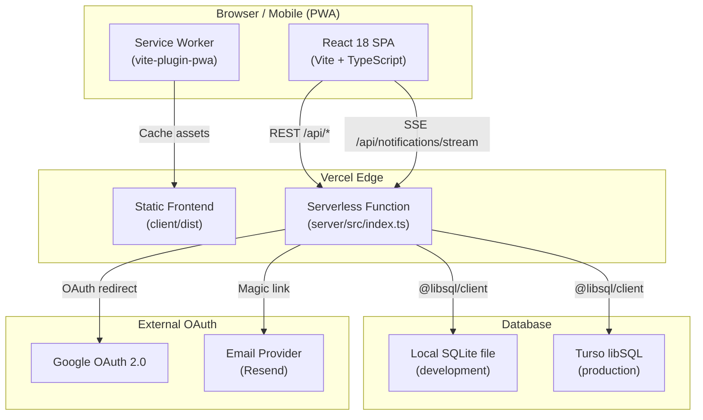
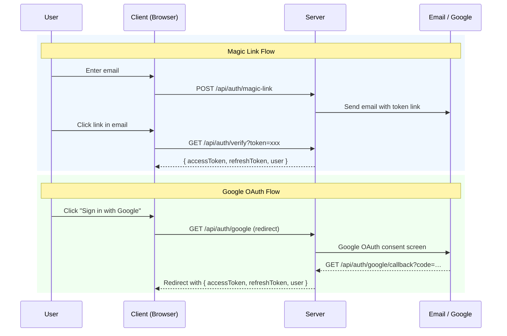
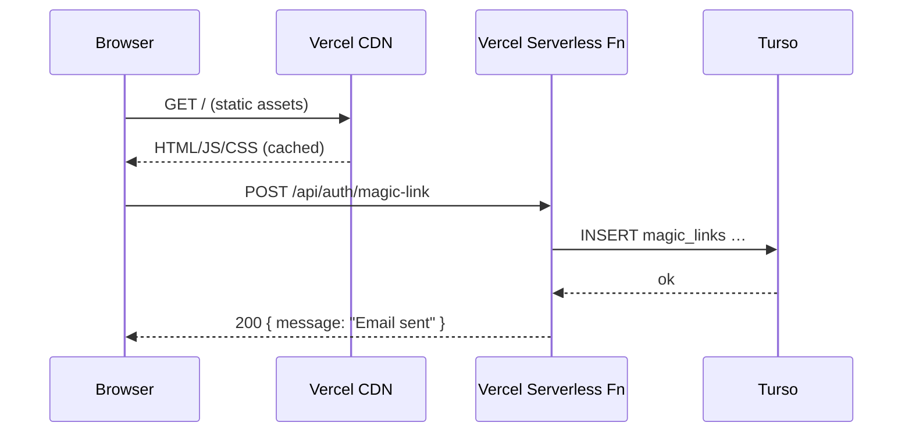

# System Architecture — Nos limites

## Overview

Nos limites is a full-stack Progressive Web App built around a **privacy-first matching model**: each user checks limits independently, and only mutual matches are ever revealed. The system is deployed entirely on Vercel with Turso as the hosted database.



---

## Frontend

| Aspect | Detail |
|--------|--------|
| Framework | **React 18** with `react-dom` |
| Build tool | **Vite 5** (`@vitejs/plugin-react`) |
| Language | **TypeScript** (strict mode) |
| Routing | **React Router v6** (`react-router-dom`) |
| QR codes | **qrcode.react v4** (invitation QR generation) |
| PWA | **vite-plugin-pwa** (service worker + web manifest) |
| Dev server | `http://localhost:5173` |
| API proxy | All `/api/*` requests proxied to `localhost:3001` in dev |

### Client Directory Layout

```
client/src/
├── App.tsx                 # Root component, router setup
├── main.tsx                # Entry point
├── vite-env.d.ts           # Vite type declarations
│
├── components/             # Reusable UI components
├── context/                # React Context providers (auth, notifications…)
├── hooks/                  # Custom React hooks
├── pages/                  # Route-level page components
├── services/               # API client (api.ts) and service abstractions
├── styles/                 # Global CSS / design tokens
└── utils/                  # Pure helper functions
```

---

## Backend

| Aspect | Detail |
|--------|--------|
| Runtime | **Node.js 18+** |
| Framework | **Express 4** |
| Language | **TypeScript** (compiled with `tsx` in dev, `tsc` for prod) |
| Dev server | `http://localhost:3001` |
| Serverless | Exported as a single Vercel Node.js function |

### Server Directory Layout

```
server/src/
├── index.ts                # Express app entry point, middleware wiring
│
├── config/                 # Environment variable loading, app configuration
├── db/
│   ├── connection.ts       # @libsql/client setup (local file vs Turso)
│   ├── schema.ts           # Drizzle ORM table definitions
│   ├── migrate.ts          # Schema migration runner
│   ├── seed.ts             # Limit categories seed data
│   ├── init.ts             # Async DB initialisation (migrations + seed)
│   └── verify-schema.ts    # Post-migration schema validation
├── middleware/             # Express middleware (auth guard, error handler…)
├── routes/                 # Express routers per domain
│   ├── auth.ts
│   ├── profile.ts
│   ├── relationships.ts
│   ├── limits.ts
│   ├── notifications.ts
│   ├── devices.ts
│   └── health.ts
├── services/               # Business logic (email, token generation…)
└── utils/                  # Shared utilities
```

---

## Database

| Environment | Driver | Connection string |
|-------------|--------|------------------|
| Local development | `@libsql/client` (file mode) | `file:./data/noslimites.db` |
| Production (Vercel) | `@libsql/client` (HTTP/WebSocket) | `libsql://…turso.io` |
| Tests | `better-sqlite3` (in-memory) | `:memory:` |

- **ORM**: Drizzle ORM — type-safe query builder with schema-as-code
- **Migrations**: run automatically on server start via `src/db/migrate.ts`
- **Seed**: limit categories seeded once if the `limits` table is empty

> See [turso-setup.md](./turso-setup.md) for full Turso provisioning steps.

---

## Real-time: Server-Sent Events (SSE)

Notifications are pushed to the browser over a persistent HTTP connection:

```
GET /api/notifications/stream
Authorization: Bearer <token>

← data: {"type":"new_common_limit","title":"…","message":"…"}\n\n
← data: {"type":"relation_accepted","title":"…","message":"…"}\n\n
```

The client maintains one SSE connection per authenticated session. New limit matches, relationship events, and read-status changes are streamed in real time.

---

## Authentication



| Token | Lifetime | Storage |
|-------|----------|---------|
| Magic link token | 15 minutes (one-use) | `magic_links` table |
| JWT access token | Short-lived (configurable) | Browser memory |
| Refresh token | 30 days per device | `devices` table (hashed) |

---

## Hosting

| Resource | Platform | Notes |
|----------|----------|-------|
| Frontend SPA | Vercel static hosting | `client/dist/` |
| Backend API | Vercel Serverless Function | `server/src/index.ts` via `@vercel/node` |
| Database | Turso (hosted libSQL) | Free tier up to 9 GB |

The `vercel.json` at the project root routes all traffic to the serverless function. The frontend is deployed separately from the `client/` directory.

---

## Request Flow (Production)


