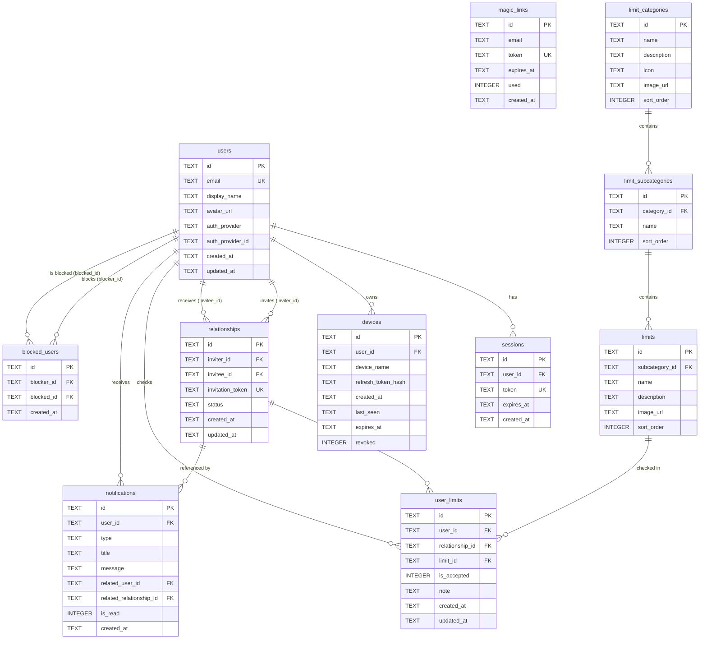

# Database Schema — Nos limites

## Overview

The database is implemented with **SQLite** (via `@libsql/client`) and managed through **Drizzle ORM**. In development it is a local file; in production it is hosted on **Turso** (libSQL-compatible).

- All primary keys are `TEXT` UUIDs generated in application code.
- Timestamps are stored as `TEXT` in ISO 8601 format (`DATETIME` semantics via application layer).
- Cascade deletes are used throughout to ensure data integrity when users or relationships are removed.
- Boolean columns use Drizzle's `integer({ mode: "boolean" })` mapping (SQLite stores `0`/`1`).

---

## ER Diagram

---

## Table Reference

### `users`

Core identity record. Created on first successful authentication.

| Column | Type | Constraints | Description |
|--------|------|-------------|-------------|
| `id` | `TEXT` | PK | UUID v4 |
| `email` | `TEXT` | UNIQUE, NOT NULL | User's email address |
| `display_name` | `TEXT` | NOT NULL | Public display name (first name / pseudonym) |
| `avatar_url` | `TEXT` | NULLABLE | URL to profile picture |
| `auth_provider` | `TEXT` | NULLABLE | `'magic_link'`, `'google'`, or `'facebook'` |
| `auth_provider_id` | `TEXT` | NULLABLE | Provider-specific user ID (for OAuth) |
| `created_at` | `TEXT` | NOT NULL | ISO 8601 timestamp |
| `updated_at` | `TEXT` | NOT NULL | ISO 8601 timestamp, updated on every write |

---

### `sessions`

Short-lived access-token sessions. Each row represents an active JWT session.

| Column | Type | Constraints | Description |
|--------|------|-------------|-------------|
| `id` | `TEXT` | PK | UUID v4 |
| `user_id` | `TEXT` | FK → `users.id` CASCADE | Owner of the session |
| `token` | `TEXT` | UNIQUE, NOT NULL | The raw JWT access token |
| `expires_at` | `TEXT` | NOT NULL | ISO 8601 expiry timestamp |
| `created_at` | `TEXT` | NOT NULL | ISO 8601 creation timestamp |

> **Cascade**: deleting a user deletes all their sessions.

---

### `magic_links`

One-time email sign-in tokens. Expire after 15 minutes and are marked `used` after first verification.

| Column | Type | Constraints | Description |
|--------|------|-------------|-------------|
| `id` | `TEXT` | PK | UUID v4 |
| `email` | `TEXT` | NOT NULL | Email address the link was sent to |
| `token` | `TEXT` | UNIQUE, NOT NULL | Cryptographically random token |
| `expires_at` | `TEXT` | NOT NULL | ISO 8601 expiry (15 minutes from creation) |
| `used` | `INTEGER` | DEFAULT `0` | Boolean — `1` once verified |
| `created_at` | `TEXT` | NOT NULL | ISO 8601 creation timestamp |

---

### `relationships`

Represents the connection between two users. Lifecycle: `pending` → `accepted` / `declined` / `blocked`.

| Column | Type | Constraints | Description |
|--------|------|-------------|-------------|
| `id` | `TEXT` | PK | UUID v4 |
| `inviter_id` | `TEXT` | FK → `users.id` CASCADE, NOT NULL | User who created the invitation |
| `invitee_id` | `TEXT` | FK → `users.id` CASCADE, NULLABLE | Set when invitation is accepted |
| `invitation_token` | `TEXT` | UNIQUE, NOT NULL | Token embedded in the QR code / invite URL |
| `status` | `TEXT` | NOT NULL, DEFAULT `'pending'` | `'pending'`, `'accepted'`, `'declined'`, `'blocked'` |
| `created_at` | `TEXT` | NOT NULL | ISO 8601 creation timestamp |
| `updated_at` | `TEXT` | NOT NULL | ISO 8601 last-update timestamp |

> **Cascade**: deleting either user cascades to this row.

---

### `limit_categories`

Top-level groupings of limits (e.g. "Contact professionnel", "Intimité"). Seeded by `db/seed.ts`.

| Column | Type | Constraints | Description |
|--------|------|-------------|-------------|
| `id` | `TEXT` | PK | Stable slug (e.g. `cat-professional`) |
| `name` | `TEXT` | NOT NULL | Display name |
| `description` | `TEXT` | NULLABLE | Short description |
| `icon` | `TEXT` | NULLABLE | Emoji or icon identifier |
| `image_url` | `TEXT` | NULLABLE | Illustrative image URL |
| `sort_order` | `INTEGER` | NULLABLE | Display ordering |

---

### `limit_subcategories`

Second-level groupings within a category (e.g. "Communication verbale" within "Contact professionnel").

| Column | Type | Constraints | Description |
|--------|------|-------------|-------------|
| `id` | `TEXT` | PK | Stable slug |
| `category_id` | `TEXT` | FK → `limit_categories.id` CASCADE, NOT NULL | Parent category |
| `name` | `TEXT` | NOT NULL | Display name |
| `sort_order` | `INTEGER` | NULLABLE | Display ordering |

---

### `limits`

Individual limit items that users can check or uncheck (e.g. "Poignée de main").

| Column | Type | Constraints | Description |
|--------|------|-------------|-------------|
| `id` | `TEXT` | PK | Stable slug |
| `subcategory_id` | `TEXT` | FK → `limit_subcategories.id` CASCADE, NOT NULL | Parent subcategory |
| `name` | `TEXT` | NOT NULL | Display name |
| `description` | `TEXT` | NULLABLE | Optional clarification |
| `image_url` | `TEXT` | NULLABLE | Illustrative image URL |
| `sort_order` | `INTEGER` | NULLABLE | Display ordering |

---

### `user_limits`

The central privacy-critical table. Records which limits each user has accepted **within a specific relationship**. The matching algorithm joins this table on `(relationship_id, limit_id)` where both `is_accepted = true`.

| Column | Type | Constraints | Description |
|--------|------|-------------|-------------|
| `id` | `TEXT` | PK | UUID v4 |
| `user_id` | `TEXT` | FK → `users.id` CASCADE, NOT NULL | The user who made this choice |
| `relationship_id` | `TEXT` | FK → `relationships.id` CASCADE, NOT NULL | The relationship context |
| `limit_id` | `TEXT` | FK → `limits.id` CASCADE, NOT NULL | The limit being checked |
| `is_accepted` | `INTEGER` | DEFAULT `0` | Boolean — `1` if the user has checked this limit |
| `note` | `TEXT` | NULLABLE | Optional personal note visible only in common limits |
| `created_at` | `TEXT` | NOT NULL | ISO 8601 |
| `updated_at` | `TEXT` | NOT NULL | ISO 8601 |

**Unique constraint**: `(user_id, relationship_id, limit_id)` — one record per user per limit per relationship.

> **Privacy note**: A row with `is_accepted = true` is **never** returned to the partner unless the partner's own row for the same `(relationship_id, limit_id)` also has `is_accepted = true`.

---

### `notifications`

In-app notification history. New rows are created by server-side business logic when relationship or limit events occur.

| Column | Type | Constraints | Description |
|--------|------|-------------|-------------|
| `id` | `TEXT` | PK | UUID v4 |
| `user_id` | `TEXT` | FK → `users.id` CASCADE, NOT NULL | Recipient |
| `type` | `TEXT` | NOT NULL | See notification types below |
| `title` | `TEXT` | NOT NULL | Short title |
| `message` | `TEXT` | NOT NULL | Full notification body |
| `related_user_id` | `TEXT` | FK → `users.id`, NULLABLE | The other user involved (if any) |
| `related_relationship_id` | `TEXT` | FK → `relationships.id` SET NULL, NULLABLE | The relationship involved (if any) |
| `is_read` | `INTEGER` | DEFAULT `0` | Boolean — `1` once the user has seen it |
| `created_at` | `TEXT` | NOT NULL | ISO 8601 |

**Notification types**: `relation_request`, `relation_accepted`, `new_common_limit`, `limit_removed`, `relation_deleted`

---

### `devices`

Long-lived refresh tokens, one per browser/device. Enables "remember this device for 30 days" and per-device revocation.

| Column | Type | Constraints | Description |
|--------|------|-------------|-------------|
| `id` | `TEXT` | PK | UUID v4 |
| `user_id` | `TEXT` | FK → `users.id` CASCADE, NOT NULL | Owner |
| `device_name` | `TEXT` | NULLABLE | Human-readable name (e.g. `"Chrome on macOS"`) |
| `refresh_token_hash` | `TEXT` | NOT NULL | Bcrypt hash of the refresh token (never stored plaintext) |
| `created_at` | `TEXT` | NOT NULL | ISO 8601 |
| `last_seen` | `TEXT` | NOT NULL | Updated on every token refresh |
| `expires_at` | `TEXT` | NOT NULL | ISO 8601 — 30 days from creation |
| `revoked` | `INTEGER` | DEFAULT `0` | Boolean — `1` once manually revoked |

---

### `blocked_users`

Records block relationships between users. A blocked user cannot send new invitations to the blocker.

| Column | Type | Constraints | Description |
|--------|------|-------------|-------------|
| `id` | `TEXT` | PK | UUID v4 |
| `blocker_id` | `TEXT` | FK → `users.id` CASCADE, NOT NULL | User who issued the block |
| `blocked_id` | `TEXT` | FK → `users.id` CASCADE, NOT NULL | User who was blocked |
| `created_at` | `TEXT` | NOT NULL | ISO 8601 |

**Unique constraint**: `(blocker_id, blocked_id)` — a user can only block another user once.

---

## Seeded Data

The `limit_categories`, `limit_subcategories`, and `limits` tables are populated by `server/src/db/seed.ts` when the database is first initialised. The seed includes 5 categories, 13 subcategories, and approximately 40 individual limit items covering a spectrum from professional contact to intimacy.

The seed is idempotent — it checks whether data already exists before inserting.
