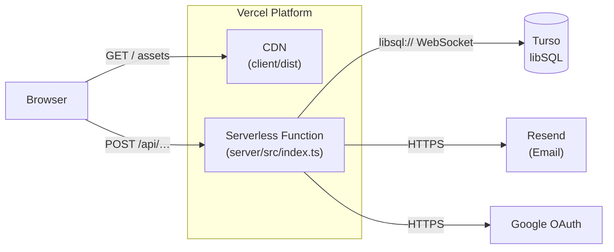

# Deployment Guide — Nos limites

## Production Stack

| Component | Platform | Notes |
|-----------|----------|-------|
| Frontend SPA | **Vercel** (static hosting) | Built from `client/`, served from CDN |
| Backend API | **Vercel** (serverless Node.js function) | `server/src/index.ts` via `@vercel/node` |
| Database | **Turso** (hosted libSQL) | Free tier up to 9 GB; globally replicated |

The backend is **not** a long-running server in production — Express runs as a Vercel serverless function invoked on each request.

---

## Architecture Overview



---

## Frontend Deployment

The frontend is a standard Vite SPA deployed as a static site.

### Vercel project settings

| Setting | Value |
|---------|-------|
| **Root directory** | `client` |
| **Framework preset** | `Vite` |
| **Build command** | `npm run build` |
| **Output directory** | `dist` |
| **Install command** | `npm install` |

### SPA routing

`client/vercel.json` configures Vercel to rewrite all unmatched paths to `index.html`, enabling React Router's client-side navigation:

```json
{
  "rewrites": [{ "source": "/(.*)", "destination": "/index.html" }]
}
```

### Environment variables (client)

The client reads the API base URL at build time. Set the following in the Vercel project for the `client` deployment:

| Variable | Example |
|----------|---------|
| `VITE_API_URL` | `https://nos-limites-api.vercel.app` |

---

## Backend Deployment

The backend is deployed as a **Vercel Serverless Function** using `@vercel/node`.

### `vercel.json` (project root)

```json
{
  "version": 2,
  "builds": [
    {
      "src": "server/src/index.ts",
      "use": "@vercel/node"
    }
  ],
  "routes": [
    {
      "src": "/(.*)",
      "dest": "server/src/index.ts"
    }
  ]
}
```

All HTTP requests are routed to the single Express function. Express then dispatches to the appropriate route internally.

### Vercel project settings

| Setting | Value |
|---------|-------|
| **Root directory** | *(project root)* |
| **Build command** | *(none — Vercel uses the `builds` array)* |
| **Framework preset** | `Other` |

---

## Environment Variables

Set these in the **Vercel Dashboard** → Project → **Settings** → **Environment Variables** for the `Production` environment.

### Required in production

| Variable | Description |
|----------|-------------|
| `NODE_ENV` | Set to `production` |
| `JWT_SECRET` | Strong random secret (e.g. `openssl rand -hex 64`) |
| `JWT_REFRESH_SECRET` | Separate strong random secret |
| `SESSION_DURATION` | e.g. `15m` for access tokens |
| `MAGIC_LINK_EXPIRY` | e.g. `15m` |
| `MAGIC_LINK_BASE_URL` | Your production frontend URL (e.g. `https://noslimites.vercel.app`) |
| `FRONTEND_URL` | Same as `MAGIC_LINK_BASE_URL` — used for CORS |
| `EMAIL_PROVIDER` | `resend` |
| `RESEND_API_KEY` | Your [Resend](https://resend.com) API key |
| `EMAIL_FROM` | Verified sender (e.g. `Nos limites <noreply@noslimites.app>`) |
| `TURSO_DATABASE_URL` | `libsql://nos-limites-<your-org>.turso.io` |
| `TURSO_AUTH_TOKEN` | Auth token from `turso db tokens create nos-limites` |

### Optional (OAuth)

| Variable | Description |
|----------|-------------|
| `GOOGLE_CLIENT_ID` | Google OAuth client ID |
| `GOOGLE_CLIENT_SECRET` | Google OAuth client secret |
| `GOOGLE_CALLBACK_URL` | `https://nos-limites-api.vercel.app/api/auth/google/callback` |
| `FACEBOOK_APP_ID` | Facebook App ID (stub — not fully implemented) |
| `FACEBOOK_APP_SECRET` | Facebook App Secret |

> **CORS**: `FRONTEND_URL` must exactly match your deployed frontend URL, including protocol and without a trailing slash (e.g. `https://noslimites.vercel.app`). A mismatch will block all browser API requests.

---

## Database Setup (Turso)

Refer to **[turso-setup.md](./turso-setup.md)** for the complete step-by-step guide covering:

1. Installing the Turso CLI
2. Creating the `nos-limites` database
3. Generating an auth token
4. Adding `TURSO_DATABASE_URL` and `TURSO_AUTH_TOKEN` to Vercel

### Connection selection logic

The server chooses the database connection automatically based on environment variables:

```
TURSO_DATABASE_URL set?
├── Yes → connect to Turso (production)
└── No  → use DATABASE_URL (local file)
```

---

## Migrations

Migrations are run **automatically on every cold start** of the serverless function. The migration runner (`src/db/migrate.ts`) uses `CREATE TABLE IF NOT EXISTS`, making it safe to run repeatedly.

To run migrations manually against the production database:

```bash
cd server
TURSO_DATABASE_URL=libsql://… TURSO_AUTH_TOKEN=… npx tsx src/db/migrate.ts
```

To seed the limit categories manually:

```bash
TURSO_DATABASE_URL=libsql://… TURSO_AUTH_TOKEN=… npx tsx src/db/seed.ts
```

---

## Deployment Checklist

Before going live, verify the following:

- [ ] `JWT_SECRET` and `JWT_REFRESH_SECRET` are set to long, random, unique values
- [ ] `TURSO_DATABASE_URL` and `TURSO_AUTH_TOKEN` are set correctly
- [ ] `FRONTEND_URL` matches the deployed frontend URL exactly
- [ ] `MAGIC_LINK_BASE_URL` matches the deployed frontend URL exactly
- [ ] `EMAIL_PROVIDER=resend` and `RESEND_API_KEY` is valid
- [ ] `EMAIL_FROM` uses a domain verified in the Resend dashboard
- [ ] Google OAuth redirect URI in Google Cloud Console matches `GOOGLE_CALLBACK_URL`
- [ ] Health check returns `200`: `curl https://nos-limites-api.vercel.app/api/health`

---

## Verifying a Deployment

```bash
# Health check
curl https://nos-limites-api.vercel.app/api/health
# Expected: {"status":"ok","database":"connected","tables":11,...}

# Auth providers
curl https://nos-limites-api.vercel.app/api/auth/providers
# Expected: {"providers":["magic_link","google"]}
```
