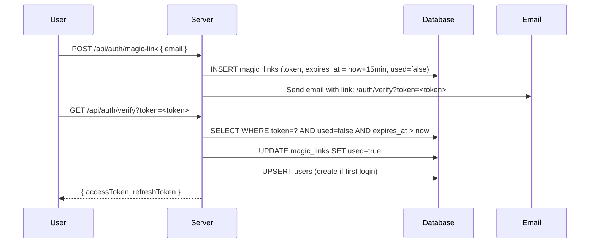

# Security & Privacy — Nos limites

## Design Philosophy

Security in *Nos limites* serves a dual purpose: protecting user accounts from unauthorised access **and** protecting the emotional vulnerability of users within the app itself. The "match" privacy model is not just a feature — it is a fundamental security guarantee backed by server-side enforcement.

---

## Authentication

### Password-less by Design

No passwords are stored — ever. Users authenticate via **magic links** (email) or **OAuth** (Google). This eliminates entire classes of vulnerability: credential stuffing, password breaches, weak passwords, and password-reset account takeovers.

### Magic Link Flow



| Property | Value |
|----------|-------|
| Token lifetime | **15 minutes** (configurable via `MAGIC_LINK_EXPIRY`) |
| One-time use | Yes — token is marked `used=true` immediately on verification |
| Token storage | Stored in `magic_links` table; never logged |

### Google OAuth Flow

The server handles the full OAuth 2.0 code exchange server-side. The browser is redirected to Google's consent screen and back — no client-side token handling required.

### Token Architecture

| Token | Lifetime | Storage location | Purpose |
|-------|----------|-----------------|---------|
| JWT access token | Short-lived (env configurable) | Browser memory (not `localStorage`) | Authenticates API requests |
| Refresh token | 30 days per device | `devices` table (bcrypt hash only) | Obtains new access tokens |
| Magic link token | 15 minutes, one-use | `magic_links` table | Email sign-in |

Refresh tokens are stored as **bcrypt hashes** in the `devices` table — the plaintext token is only ever held in the response body and in the browser.

### Per-Device Sessions

Each device (browser) registers its own refresh token in the `devices` table. Users can view and revoke individual device sessions via `GET /api/devices` and `DELETE /api/devices/:id`. This means a compromised device session can be invalidated without logging out every other device.

---

## The "Match" Privacy Model

This is the most important privacy guarantee in the application.

> **A user's checked limits are NEVER visible to their partner unless both users have independently checked the same limit.**

### How it is enforced

The `user_limits` table stores each user's choices keyed by `(user_id, relationship_id, limit_id)`. The **only** endpoint that reveals limit data across users is `GET /api/relationships/:id/common-limits`, which applies a server-side join:

```sql
-- Conceptual query (simplified)
SELECT l.*
FROM user_limits a
JOIN user_limits b
  ON a.relationship_id = b.relationship_id
  AND a.limit_id = b.limit_id
WHERE a.relationship_id = :relationshipId
  AND a.user_id = :currentUserId
  AND b.user_id = :partnerId
  AND a.is_accepted = true
  AND b.is_accepted = true
```

No API endpoint returns a partner's individual `user_limits` rows — only the intersection.

### Why this matters

A user may check a limit freely, knowing that:
- If their partner has **not** checked the same limit → **neither party learns anything**
- If their partner **has** checked the same limit → both see the match

This design encourages openness (you lose nothing by checking) while protecting vulnerability (no one knows what you've checked unless it's mutual).

---

## Route Protection

All API routes (except those explicitly marked 🔓 in the [API Reference](./api.md)) are protected by an authentication middleware that:

1. Reads the `Authorization: Bearer <token>` header
2. Verifies the JWT signature using `JWT_SECRET`
3. Checks the token has not expired
4. Attaches the decoded `userId` to the request context

Any request missing a valid token receives `401 Unauthorized` immediately, before any business logic executes.

---

## Input Validation

All API route handlers validate request inputs before processing:

- Required fields are checked for presence
- Email addresses are validated for format
- UUIDs and tokens are checked against expected patterns
- Array payloads (e.g. bulk limit updates) are validated for structure
- Numeric fields are type-coerced and range-checked where applicable

Invalid input returns `400 Bad Request` with a descriptive error message.

---

## CORS Policy

The server restricts cross-origin requests to the configured frontend URL:

```
Access-Control-Allow-Origin: <FRONTEND_URL>
```

Any request from a different origin is rejected by the CORS middleware before it reaches any route handler. In production, `FRONTEND_URL` must be set to the exact deployed frontend URL (e.g. `https://noslimites.vercel.app`).

---

## GDPR Compliance

### Data export

`GET /api/profile/export` returns a complete JSON export of all personal data held for the authenticated user:

- Profile information (`users` record)
- All relationships and their statuses
- All limit choices (`user_limits` records)
- Notification history

The export is delivered as a downloadable JSON file.

### Right to erasure (account deletion)

`DELETE /api/profile` permanently and irreversibly deletes:

| Table | What is deleted |
|-------|----------------|
| `users` | The user record itself |
| `sessions` | All active sessions (cascade) |
| `devices` | All device/refresh token records (cascade) |
| `relationships` | All relationships where user is inviter or invitee (cascade) |
| `user_limits` | All limit choices across all relationships (cascade) |
| `notifications` | All notifications sent to this user (cascade) |

The cascade is enforced at the database level via `ON DELETE CASCADE` foreign key constraints in the Drizzle schema.

---

## Blocked Users

When a user blocks another:

1. A row is created in `blocked_users`
2. The relationship status is set to `blocked`
3. The blocked user **cannot** send new invitations to the blocker
4. The `POST /api/relationships/invite` and `POST /api/relationships/accept/:token` routes check the `blocked_users` table before proceeding

---

## Sensitive Data Handling

| Data | How it is protected |
|------|-------------------|
| Magic link tokens | One-time use, 15-minute expiry, never logged |
| Refresh tokens | Stored as bcrypt hash only |
| JWT secrets | Environment variables, never committed to source code |
| Turso auth token | Environment variable, never committed to source code |
| User limit choices | Server-side match enforcement — raw choices never exposed to partners |

---

## Security Checklist (Production)

- [ ] `JWT_SECRET` and `JWT_REFRESH_SECRET` are unique, cryptographically random strings (≥ 64 hex chars)
- [ ] `DATABASE_URL` / Turso credentials are set only as environment variables — never in source code
- [ ] `FRONTEND_URL` is set to the exact production URL (no trailing slash)
- [ ] `NODE_ENV=production` disables development-only behaviours
- [ ] `EMAIL_PROVIDER=resend` (not `console`) so magic links are not visible in logs
- [ ] HTTPS is enforced on both frontend and backend (handled by Vercel)
- [ ] OAuth redirect URIs in Google Cloud Console are restricted to the production domain only
